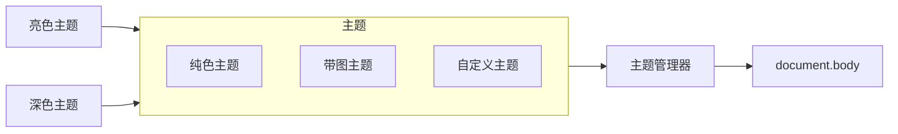

随着 CSS Variables 的普及，切换网站主题变成了一件轻松又愉快的工作，只需简单在 `@media (prefers-color-scheme: dark) ` 下指定新的 `--*` 变量即可。但如果有多个主题，或者是主题嵌套该怎么办呢？
本文将告诉你如何解决这一切。



# 主题复用

假设我们有三个主题，
- 纯色默认主题 A （即 :root）
- 暗色主题 B 继承自 A
- 带图主题 C 继承自 A

很明显，我们可以写成下面这样的样式表。

```css
:root,
[data-theme='B'],
[data-theme='C'] {
    --red: #f00;
    --bg: #fff;
}

[data-theme='B'] {
    --bg: #000;
}

[data-theme='C'] {
    --background: url(c.png)
}

:root {
    --bg: #fff;
}

```

但我们很快发现一个问题，主题间可能存在覆盖问题，A 与 B 的 CSS 优先级是一样的，如果有一个在下方就会被覆盖，那如何能加深这个深色模式呢？答案是加一层选择器。


我们发现 data-theme 已经不适合表达包含明暗和其他配色的多个主题了，于是用 data-mode 来表示明暗。

```css
:root,
[data-theme='A'],
[data-theme='A'][data-mode='light'],
[data-theme='B'][data-mode='dark'],
[data-mode='dark'],
[data-theme='C'],
[data-theme='C'][data-mode='light'] {
    --red: #f00;
    --bg: #fff;
}

[data-mode='dark'],
[data-theme='B'][data-mode='dark'], {
    --bg: #000;
}

[data-theme='C'],
[data-theme='C'][data-mode='light'] {
    --background: url(c.png)
}

// 其他地方引入的样式

:root {
    --bg: #fff;
}

```

看起来多了很多无用的代码，但我们列个表格来分析下各种组合。

| 明暗 | A | B | C |
|:--|:--|:--|:--|
| Light | 白底无图 | N/A | 白底带图 |
| Dark | N/A | 黑底无图 | N/A |

可以看到最后一个 :root 由于优先级不如前方主题将不会覆盖前面的样式。

# 主题嵌套

前面我们解决了平级主题的复用，但如果是父子元素的嵌套呢？这时就变成了一个 CSS Variables 的嵌套。
